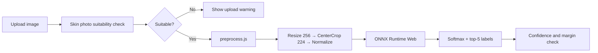

# Skin Disease CNN Classifier

Train a **ResNet50** model on the [HAM10000](https://www.kaggle.com/datasets/kmader/skin-cancer-mnist-ham10000) skin lesion dataset, export it to ONNX, and run **browser-based inference** in a Next.js demo app.

## Overview

| Component | Description |
|-----------|-------------|
| **Model** | ResNet50 with transfer learning (ImageNet → 7 skin classes) |
| **Dataset** | HAM10000 — 10,015 dermoscopy images, 7 diagnostic categories |
| **Training** | Google Colab notebook (`skin_classifier.ipynb`) |
| **Inference** | ONNX Runtime Web in the browser (no server round-trip) |
| **Validation** | Browser-side image suitability check before classification |

### Skin disease classes

| Code | Label |
|------|-------|
| akiec | Actinic Keratosis |
| bcc | Basal Cell Carcinoma |
| bkl | Benign Keratosis |
| df | Dermatofibroma |
| mel | Melanoma |
| nv | Melanocytic Nevi |
| vasc | Vascular Lesions |

## Quick start (demo app)

```bash
npm install
npm run dev
```

Open [http://localhost:3000](http://localhost:3000), upload a skin lesion image, and click **Classify image**.

The app expects a trained ONNX model at `public/models/resnet50_skin.onnx`. Generate it from the Colab notebook or with `export_skin_onnx.py --checkpoint best_resnet50_skin.pth`.

## Project structure

```
py-react-onnx-resnet50/
├── skin_classifier.ipynb      # Full training pipeline (Parts 1–5) for Google Colab
├── export_skin_onnx.py        # Export trained PyTorch model → ONNX
├── export_onnx.py             # Legacy ImageNet ResNet50 export
├── app/
│   └── components/
│       └── ImageClassifier.js # Browser upload + inference UI
├── lib/
│   └── preprocess.js          # Resize/CenterCrop/Normalize (matches torchvision)
└── public/
    ├── models/
    │   └── resnet50_skin.onnx # ONNX model (generated)
    ├── data/
    │   └── skin_labels.json   # 7 class labels
    └── sample-skin.webp       # Sample dermoscopy image
```

## Training workflow (Google Colab)

1. Upload `skin_classifier.ipynb` to [Google Colab](https://colab.research.google.com/)
2. Set runtime to **T4 GPU** (Runtime → Change runtime type)
3. Add your [Kaggle API token](https://www.kaggle.com/settings) when prompted
4. Run all cells top to bottom:
   - **Part 1** — Download HAM10000, stratified 70/15/15 split
   - **Part 2** — Preprocessing and data augmentation
   - **Part 3** — ResNet50 transfer learning (20 epochs, early stopping)
   - **Part 4** — Metrics, confusion matrix, training curves
   - **Part 5** — ONNX export and file download
5. Download `best_resnet50_skin.pth` and `resnet50_skin.onnx` from Colab

### Hyperparameters (Part 3)

| Setting | Value |
|---------|-------|
| Architecture | ResNet50 (ImageNet pretrained) |
| Fine-tuned layers | `layer4` + custom fc head |
| Optimizer | AdamW |
| Learning rate | 1e-4 (backbone), 1e-3 (fc head) |
| Loss | CrossEntropyLoss (class-weighted) |
| Batch size | 32 |
| Epochs | 20 (early stopping, patience=5) |

## Export ONNX model

### Placeholder (app loads, predictions not trained)

```bash
python export_skin_onnx.py
# or
npm run export:skin
```

This writes `public/models/resnet50_skin.onnx` using the ImageNet backbone and an untrained 7-class head so the demo app can load.

### Trained model (after Colab)

```bash
python export_skin_onnx.py --checkpoint best_resnet50_skin.pth
```

Copy the exported file to `public/models/resnet50_skin.onnx` if needed, then refresh the browser.

**Requirements:** Python 3, `torch`, `torchvision`

## How inference works



Preprocessing in `lib/preprocess.js` matches torchvision eval transforms used during training.

### Photo validation

The browser demo now checks whether the upload looks like a usable close-up skin/lesion photo before inference. It rejects obviously invalid images, such as very dark, overexposed, or non-skin-like photos, and warns when the model confidence or top-class margin is low.

This validation is a safety/quality gate, not a medical diagnosis. A ResNet50 trained only on HAM10000 disease classes cannot prove that a disease is present or detect every out-of-distribution image. For a stronger validator, train a separate binary model with `valid_skin_lesion` vs `invalid_or_non_skin` examples and run it before the disease classifier.

## Academic deliverables

The Colab notebook covers all project requirements:

- Dataset description, class counts, sample images
- Preprocessing workflow and augmented samples
- Architecture diagram, model summary, hyperparameters
- Accuracy / precision / recall / F1, confusion matrix, training curves
- 20 sample predictions with confidence scores
- Live demo via this Next.js app

## Dataset citation

If you use HAM10000, cite:

> Tschandl, P., Rosendahl, C. & Kittler, H. The HAM10000 dataset, a large collection of multi-source dermatoscopic images of common pigmented skin lesions. *Sci. Data* **5**, 180161 (2018). [doi:10.1038/sdata.2018.161](https://doi.org/10.1038/sdata.2018.161)

HAM10000 is licensed **CC BY-NC 4.0** (non-commercial use).

## Disclaimer

This project is for **educational and research purposes only**. It is not a medical device and must not be used for clinical diagnosis.
