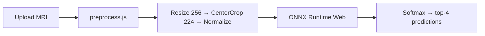

# Brain Tumor CNN Classifier

Train a **ResNet50** model on the [Brain Tumor MRI Dataset](https://www.kaggle.com/datasets/masoudnickparvar/brain-tumor-mri-dataset) (4 classes, ~7,000 MRI images), export it to ONNX, and run **browser-based inference** in a Next.js demo app.

## Overview

| Component | Description |
|-----------|-------------|
| **Model** | ResNet50 with transfer learning (ImageNet → 4 brain tumor classes) |
| **Dataset** | Brain Tumor MRI — 7,023 MRI images, 4 diagnostic categories |
| **Training** | Google Colab notebook (`brain_tumor_classifier.ipynb`) |
| **Inference** | ONNX Runtime Web in the browser (no server round-trip) |

### Brain tumor classes

| Code | Label |
|------|-------|
| glioma | Glioma Tumor |
| meningioma | Meningioma Tumor |
| notumor | No Tumor |
| pituitary | Pituitary Tumor |

## Quick start (demo app)

```bash
npm install
npm run dev
```

Open [http://localhost:3000](http://localhost:3000), upload a brain MRI image, and click **Classify image**.

A sample brain MRI can be downloaded from the [Kaggle dataset test split](https://www.kaggle.com/datasets/masoudnickparvar/brain-tumor-mri-dataset) or [Radiopaedia](https://radiopaedia.org) (educational use).

The app expects a trained ONNX model at `public/models/resnet50_brain.onnx`. Generate it from the Colab notebook or with `export_brain_onnx.py --checkpoint best_resnet50_brain.pth`.

## Project structure

```
py-react-onnx-resnet50/
├── brain_tumor_classifier.ipynb   # Full training pipeline (Parts 1–5) for Google Colab
├── export_brain_onnx.py           # Export trained PyTorch model → ONNX
├── app/
│   └── components/
│       └── ImageClassifier.js     # Browser upload + inference UI
├── lib/
│   └── preprocess.js              # Resize/CenterCrop/Normalize + MRI validation
└── public/
    ├── models/
    │   └── resnet50_brain.onnx    # ONNX model (generated)
    └── data/
        └── brain_labels.json      # 4 class labels
```

## Training workflow (Google Colab)

1. Upload `brain_tumor_classifier.ipynb` to [Google Colab](https://colab.research.google.com/)
2. Set runtime to **T4 GPU** (Runtime → Change runtime type)
3. Add your [Kaggle API token](https://www.kaggle.com/settings) when prompted
4. Run all cells top to bottom:
   - **Part 1** — Download dataset, 70/15/15 split, class counts, sample images
   - **Part 2** — Preprocessing and data augmentation
   - **Part 3** — ResNet50 transfer learning (20 epochs, early stopping)
   - **Part 4** — Metrics, confusion matrix, training curves, 20-trial predictions
   - **Part 5** — ONNX export and file download
5. Download `best_resnet50_brain.pth` and `resnet50_brain.onnx`

### Hyperparameters (Part 3)

| Setting | Value |
|---------|-------|
| Architecture | ResNet50 (ImageNet pretrained) |
| Fine-tuned layers | `layer4` + custom fc head |
| Optimizer | AdamW |
| Learning rate | 1e-4 (backbone), 1e-3 (fc head) |
| Loss | CrossEntropyLoss |
| Batch size | 32 |
| Epochs | 20 (early stopping, patience=5) |
| Expected accuracy | 90–98% |

## Export ONNX model

### Placeholder (app loads, predictions not trained)

```bash
python export_brain_onnx.py
# or
npm run export:brain
```

### Trained model (after Colab)

```bash
python export_brain_onnx.py --checkpoint best_resnet50_brain.pth
```

**Requirements:** Python 3, `torch`, `torchvision`

## How inference works



The app also runs `validateBrainMRI` on load to warn if the uploaded image does not look like a grayscale MRI scan.

## Academic deliverables

The Colab notebook covers all project requirements:

- Dataset description, class counts, sample MRI images
- Preprocessing workflow and augmented samples
- ResNet50 architecture diagram, model summary, hyperparameters
- Accuracy / Precision / Recall / F1, confusion matrix, training curves
- 20 sample predictions with confidence scores
- Live demo via this Next.js app

## Dataset citation

> Nickparvar, M. (2021). Brain Tumor MRI Dataset. Kaggle.
> [https://www.kaggle.com/datasets/masoudnickparvar/brain-tumor-mri-dataset](https://www.kaggle.com/datasets/masoudnickparvar/brain-tumor-mri-dataset)

## Disclaimer

This project is for **educational and research purposes only**. It is not a medical device and must not be used for clinical diagnosis or treatment decisions.
